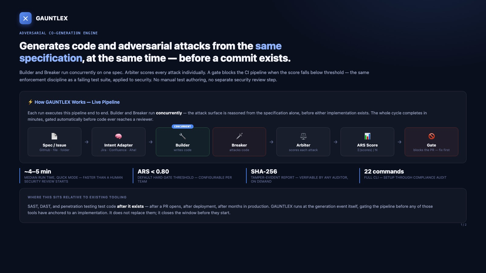
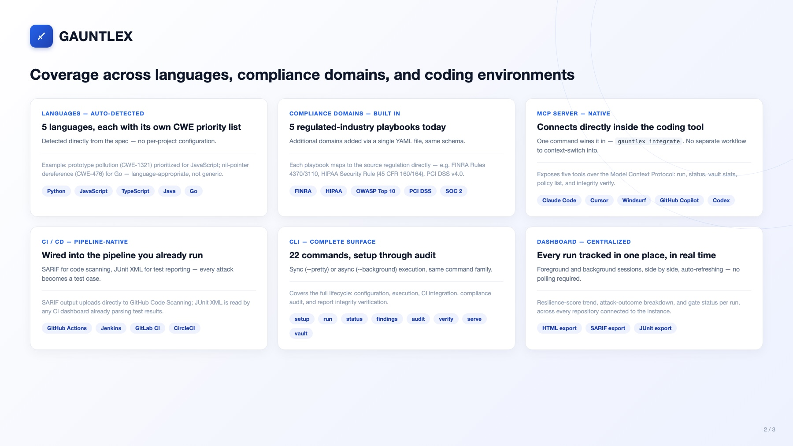

<div align="center">

# ⚔️ GAUNTLEX

### Adversarial Co-Generation Engine

**Generates code and adversarial attacks from the same specification, at the same time — before a commit exists.**

<!-- mcp-name: io.github.sanjoy1234/gauntlex -->

[](https://github.com/sanjoy1234/gauntlex/actions)
[](https://pypi.org/project/gauntlex-ai/)
[](https://pypi.org/project/gauntlex-ai/)
[](LICENSE)
[](#requirements)

[**What it is**](#what-it-is) ·
[**See it run**](#see-it-run) ·
[**Quickstart**](#quickstart) ·
[**Commands**](#cli-reference) ·
[**Domains**](#compliance--domain-coverage) ·
[**IDE Integrations**](#ide--agent-integrations) ·
[**Deep Dive**](docs/DEEP_DIVE.md)

</div>

---

## What it is

Every AI coding tool ships code and hopes someone tests it for security later.
GAUNTLEX removes the "later." It runs two agents concurrently against the same
specification:

- **Builder** — generates the implementation
- **Breaker** — generates adversarial attacks against the same spec, at the same instant

An **Arbiter** scores every attack (mitigated / partial / missed) and produces
an **Adversarial Resilience Score (ARS)**. A configurable gate blocks your CI
pipeline when the score falls below threshold — the same way a failing test
suite blocks a merge.

No manual test authoring. No separate security review step. No waiting for a
scanner to catch up to code that shipped last week.

---

## See it run
**📊 One-page overview** — what it is, what's different, how it deploys. Built for sharing with a technical lead or architecture review board.




**[Download the full PDF](docs/media/GAUNTLEX_Overview.pdf)**

**Watch the Demo**
<video src="https://github.com/user-attachments/assets/c1a5dcb6-b4ac-4699-ab3a-0ca58e78dd90" controls muted></video>
Setup through the CI gate, real terminal output, real dashboard — concurrent Builder + Breaker, HIPAA domain testing, and every IDE integration in one pass.

---

## Why it's structurally different

Three properties, not features — the reasoning behind each is in the [Deep Dive](docs/DEEP_DIVE.md):

1. **Concurrent, not sequential.** Builder and Breaker fire at the same instant via `asyncio.gather()`. The Breaker never sees generated code — it reasons from the specification alone, the same surface a real attacker would work from before your implementation choices exist.
2. **A native MCP integration, both directions.** GAUNTLEX exposes itself as an MCP server so Claude Code, Cursor, Windsurf, or Zed can trigger and poll runs directly from your coding tool — and it consumes external MCP servers (plus built-in CISA KEV / NIST NVD feeds) to enrich every run with live threat data. See the [Domain Intelligence](docs/DOMAIN_INTELLIGENCE.md) page for exactly what's live vs. static.
3. **Regulatory domains as first-class input.** FINRA, HIPAA, PCI DSS, SOC 2, and OWASP Top 10 playbooks steer the Breaker toward the scenarios that actually matter for a regulated codebase — not a generic scan re-labeled per industry.

---

## Where GAUNTLEX fits vs. other security testing

Not a replacement for any of these — a different point in the lifecycle. Static analysis and pentests are still worth doing; GAUNTLEX exists because neither of them runs *while the code is being generated*.

| | Traditional SAST (Semgrep, Snyk, etc.) | Manual pentest | No dedicated testing | GAUNTLEX |
|---|---|---|---|---|
| **When it runs** | After code is written | After code is written, periodically | Never, until an incident | Same instant as generation |
| **What it tests** | Known vulnerability patterns in existing code | The live, deployed system | Nothing dedicated | The spec-to-code pipeline itself |
| **Speed** | Minutes per scan | Days to weeks per engagement | — | ~45s–12min per run (mode-dependent) |
| **Cost** | Free–moderate | High (specialist time) | "Free" until it isn't | Free, open source |
| **Compliance mapping** | Varies by tool | Manual, engagement-specific | None | Built-in — OWASP/HIPAA/FINRA/PCI-DSS/SOC2 + CWE + NIST SSDF/SAMM/ISO 27001 |
| **Output you can verify later** | Scan report | Pentest report | — | SHA-256 tamper-evident report (`gauntlex verify`) |

---

## Quickstart

```bash
gauntlex setup        # start here — interactive, detects and validates the best
                       # model for your environment (Ollama, OpenRouter free
                       # tier, or your own API key)

gauntlex run --issue examples/demo_issue.md --mode quick --pretty   # then run the demo spec
```

Install first with `pip install gauntlex-ai`, or skip the install entirely with `uvx --from gauntlex-ai gauntlex setup`.

`gauntlex setup` writes your model provider and credentials to `.env` for
you — there is no manual configuration step, and no fallback to whatever API
key happens to be lying around the environment. What you configure during
setup is what runs, always (run `gauntlex init` separately if you also want
a `.gauntlex.yml` with tunable defaults like `rounds_max` or the gate
threshold).

```
──────────────────────────────────────────────────────────────────────
  GAUNTLEX Adversarial Run
  Mode:      quick (5 attacks)
  Language:  python  [signals: filesystem, async]
  Domain:    owasp_top10
──────────────────────────────────────────────────────────────────────
  ARS Score: 0.87  ✅  PASSED  (gate: ≥ 0.80)

  ✅ CWE-89  SQL Injection via username param     mitigated
  ✅ CWE-502 Unsafe deserialization                mitigated
  ✅ CWE-78  OS command injection in file path     mitigated
  ✅ CWE-22  Path traversal in upload handler       mitigated
  ❌ CWE-79  Reflected XSS in error message         MISSED
──────────────────────────────────────────────────────────────────────
```

Wall-clock time depends on which model you configure — anywhere from single-digit
seconds with a fast paid API to several minutes with a free-tier or local model.
Attack count *targets* 5/20/50 by mode (`quick`/`standard`/`thorough`), spread
across the adversarial rounds — actual totals land close to but not always
exactly at the target (a `thorough` run might fire ~30–50, for example),
since it depends on how many attacks the model actually returns per round.

### Run against a GitHub issue directly

```bash
gauntlex run --issue https://github.com/your-org/your-repo/issues/42 --mode standard --domain hipaa --pretty
```

### Add business intent — attack surface = spec + why it's needed

`--issue` is the spec — precise enough for the Builder and Breaker to implement and attack. It answers *what* to build. `--intent` adds a second, separate input answering *why* it's needed, pulled from wherever your team actually tracks that: a Jira key, a Confluence page, or an Aha! roadmap item. GAUNTLEX reasons from both together, not just the spec alone.

```bash
gauntlex run --issue SPEC.md --intent PROJ-123 --domain hipaa --pretty
```

`gauntlex setup` connects Jira/Confluence/Aha! automatically if it detects credentials in your environment — see the interactive wizard's business intent step.

### Requirements

- Python 3.11+
- macOS, Linux, or Windows (WSL2 recommended on Windows)
- One model provider: [Ollama](https://ollama.com) (free, local), OpenRouter free tier, or an Anthropic/OpenAI API key

---

## CLI reference

All 22 commands, grouped by when you'd reach for them:

| Getting started | |
|---|---|
| `gauntlex setup` | Configure model provider and integrations (run any time to reconfigure) |
| `gauntlex init` | Scaffold `.gauntlex.yml` with sensible defaults |
| `gauntlex doctor` | Full environment health check |
| `gauntlex validate` | Dry run — checks config and connectivity, fires zero attacks |

| Running assessments | |
|---|---|
| `gauntlex run` | Run adversarial Builder + Breaker on a spec |
| `gauntlex status` | Show running and recently completed runs |
| `gauntlex findings` | Vulnerability findings from the last run — fix-first, score last |
| `gauntlex compare` | Diff two Resilience Reports — ARS delta and attack-level changes |
| `gauntlex learn` | Feed a run into the Knowledge Forge + Forge Ledger (runs automatically after every `gauntlex run` — use this to re-process an older run) |

| Evidence & compliance | |
|---|---|
| `gauntlex report` | Render a stored report in any output format (HTML/SARIF/JUnit/JSON) |
| `gauntlex verify` | Re-derive SHA-256 integrity hash, confirm a report hasn't been altered |
| `gauntlex audit` | List all reports with compliance control mapping over a time window |
| `gauntlex vault` | Browse the Forge Ledger — human-readable Markdown attack records |
| `gauntlex stats` | ARS trends, learning-curve, and cost metrics |

| Domains & policy | |
|---|---|
| `gauntlex policy` | List, install, search, or validate policy domains — see [Domain Intelligence](docs/DOMAIN_INTELLIGENCE.md) |

| Team & CI deployment | |
|---|---|
| `gauntlex integrate` | One command: wire GAUNTLEX into Claude Code, Cursor, Windsurf, Copilot, Codex, Zed, Antigravity, or GitHub Actions |
| `gauntlex mcp-server` | Start GAUNTLEX as an MCP server (stdio transport) for local IDE use |
| `gauntlex serve` | Start GAUNTLEX as a webhook/CI service, with optional GitHub team-based RBAC |
| `gauntlex dashboard` | Launch the GAUNTLEX dashboard web UI (also serves a live leaderboard at `/leaderboard`) |
| `gauntlex leaderboard` | Build a *static* ARS leaderboard HTML page across multiple agents/runs — e.g. for GitHub Pages |
| `gauntlex forge-network` | Opt-in community adversarial pattern sharing |
| `gauntlex prune` | Remove expired reports |

Full usage, flags, and examples for every command: [Deep Dive → Complete CLI Reference](docs/DEEP_DIVE.md#complete-cli-reference).

---

## Language support

Auto-detected from the specification — no per-project configuration:

| Language | Priority CWEs (examples) |
|---|---|
| Python | SQL injection, OS command injection, unsafe deserialization, path traversal |
| JavaScript / TypeScript | Prototype pollution, XSS, CSRF, SSRF |
| Java | Deserialization, XXE, authorization bypass |
| Go | Race conditions, nil-pointer dereference, resource exhaustion |

---

## Compliance & domain coverage

5 regulated-industry playbooks ship today — **43 attack scenarios total**, each
mapped to a specific rule or control, not a generic label:

| Domain | Scenarios | Regulatory framework |
|---|---|---|
| `owasp_top10` | 12 | OWASP Top 10 (2021/2025) |
| `finra` | 9 | FINRA Rules 4370, 3110; SEC Rule 17a-4 |
| `hipaa` | 9 | HIPAA Security Rule (45 CFR §§160, 164) |
| `soc2` | 7 | AICPA SOC 2 Trust Service Criteria |
| `pci_dss` | 6 | PCI DSS v4.0 |

Two more (`owasp_api_security`, `nist_ssdf`) are available via `gauntlex
policy install`. GDPR, FedRAMP, and DORA are on the [roadmap](docs/DEEP_DIVE.md#roadmap)
— not available today.

**For exactly what's live threat data vs. static playbook content, and how to
bring your own domain, see the full
[Domain Intelligence page](docs/DOMAIN_INTELLIGENCE.md).**

---

## IDE & agent integrations

One command wires GAUNTLEX into whatever AI coding tool you already have open:

```bash
gauntlex integrate --dry-run               # preview every config it would write, writes nothing
gauntlex integrate                         # wire up every supported target at once
gauntlex integrate --platform claude-code  # or just one — .mcp.json
gauntlex integrate --platform cursor       # .cursor/mcp.json
gauntlex integrate --platform windsurf     # ~/.codeium/windsurf/mcp_config.json
gauntlex integrate --platform copilot      # .vscode/mcp.json
gauntlex integrate --platform codex        # ~/.codex/config.toml
gauntlex integrate --platform zed          # .zed/settings.json
gauntlex integrate --platform antigravity  # ~/.gemini/config/mcp_config.json
gauntlex integrate --platform github-actions  # .github/workflows/gauntlex.yml CI gate
```

Each target gets the right file, format, and schema for that specific tool —
this command handles the differences so you don't have to — and it **merges**
into any config you already have rather than overwriting it, so other MCP
servers you've already configured survive.

**Claude Code users** can also install via the plugin marketplace instead of
`integrate`:
```
/plugin marketplace add sanjoy1234/gauntlex
/plugin install gauntlex@gauntlex
```
This registers the MCP server and all `/gauntlex:*` skills (`run`, `verify`,
`doctor`, `compare`, `report`, `learn`, `validate`) in one step, updated via
`/plugin update`. Requires `gauntlex` on `PATH` (`pip install gauntlex-ai`).

**Zero-config:** this repo ships an [AGENTS.md](AGENTS.md) that Codex, Cursor,
Cline, Windsurf, and Gemini CLI read automatically with no install step at
all — copy the pattern into your own repo if you're building on top of
GAUNTLEX rather than just using it.

Exact file paths per platform, the merge-safety guarantees, and the MCP
tools GAUNTLEX exposes (`gauntlex_run`, `gauntlex_status`, `gauntlex_verify`,
and more): **[Integrations guide](docs/INTEGRATIONS.md)**.

---

## Enterprise deployment

- **`gauntlex dashboard`** — ARS trend, gate status, and attack-outcome breakdown across every connected repository. One URL for the team.
- **`gauntlex serve --rbac`** — GitHub team-based access control (admin / reviewer / developer) across a shared instance.
- **`gauntlex audit`** — every run listed with NIST SSDF / OWASP SAMM / SOC 2 control mapping, for a configurable window.
- **Air-gapped operation** — the full engine runs on local Ollama with zero outbound calls, for environments that can't reach the internet.

Full detail on each: [Deep Dive → Enterprise Features](docs/DEEP_DIVE.md#enterprise-features).

---

## Key terms

- **Adversarial Resilience Score (ARS)** — the mean of per-attack scores (mitigated=1.0, partial=0.5, missed=0.0) across every attack fired at a run. Range [0.0, 1.0]. The core metric GAUNTLEX produces.
- **Builder** — the agent that generates code from the specification.
- **Breaker** — the agent that generates adversarial attacks from the same specification, at the same instant, without seeing the Builder's output.
- **Concurrent co-generation** — Builder and Breaker running via `asyncio.gather()` against the same spec at the same time, instead of testing after code is written.
- **Resilience Report** — the tamper-evident output of a GAUNTLEX run, including a SHA-256 hash over the ordered attack results, independently verifiable via `gauntlex verify`.
- **Gate** — the CI check that blocks a merge when a run's ARS falls below the configured threshold (default 0.80).

---

## FAQ

**How do I test AI-generated code for security vulnerabilities?**
Point GAUNTLEX at the same specification your AI coding tool used: `gauntlex run --spec your_spec.md --mode quick`. It fires adversarial attacks derived from that spec and returns an Adversarial Resilience Score in under a minute.

**What is an Adversarial Resilience Score (ARS)?**
The mean of per-attack scores (mitigated = 1.0, partial = 0.5, missed = 0.0) across every attack fired at a run — a continuous [0.0, 1.0] measure of how well the generated code holds up, not a simple pass/fail count. Full formula and reasoning: the [ARS explainer](https://dev.to/sanjoy1234/the-adversarial-resilience-score-a-new-metric-for-ai-generated-code-4gej).

**Does GAUNTLEX test code before or after it's generated?**
At the same instant. The Breaker agent reasons from the specification directly, concurrently with the Builder — it never waits for code to exist first, which is what "concurrent, not sequential" means in practice.

**Which compliance frameworks does GAUNTLEX support?**
OWASP Top 10, HIPAA, FINRA, PCI DSS, and SOC 2 out of the box, with NIST SSDF and OWASP API Security available as installable extensions. See [Domain Intelligence](docs/DOMAIN_INTELLIGENCE.md) for exactly what's covered per domain.

**Can GAUNTLEX run without sending code to an external API?**
Yes — the full engine runs on local Ollama with zero outbound calls, for air-gapped or compliance-restricted environments.

More questions, including gating thresholds and contributing a new policy domain: [full FAQ in the Deep Dive](docs/DEEP_DIVE.md#faq).

---

## Learn more

- **[Deep Dive](docs/DEEP_DIVE.md)** — the full story: why concurrent execution matters, how GAUNTLEX compares to SAST/DAST/pentest, the complete CLI and configuration reference, architecture, FAQ, and roadmap.
- **[Domain Intelligence](docs/DOMAIN_INTELLIGENCE.md)** — exactly what's covered per regulated domain, what's live vs. static, and how to extend it.
- **[Contributing](docs/DEEP_DIVE.md#contributing)** — how to add a policy domain, a language profile, or a feature.

---

## Where to find GAUNTLEX

**Package & registries**
- [PyPI](https://pypi.org/project/gauntlex-ai/) — `pip install gauntlex-ai`
- [Official MCP Registry](https://registry.modelcontextprotocol.io) — listed as `io.github.sanjoy1234/gauntlex`

**Writing**
- [dev.to — "Why I Built an Adversarial Co-Generation Engine"](https://dev.to/sanjoy1234/why-i-built-an-adversarial-co-generation-engine-2038)
- [LinkedIn Article — "The Math That Breaks When AI Writes a Million Lines of Code"](https://www.linkedin.com/feed/update/urn:li:activity:7482279870576611328/)

**Community**
- [GitHub Discussions](https://github.com/sanjoy1234/gauntlex/discussions) — questions, feedback, and "I built X with this" show-and-tell

---

## Acknowledgments

- [Deven Samant](https://www.linkedin.com/in/devensamant/) — early feedback and validation

---

<div align="center">

MIT License · Built by **[Sanjoy Ghosh](https://github.com/sanjoy1234)**

</div>
